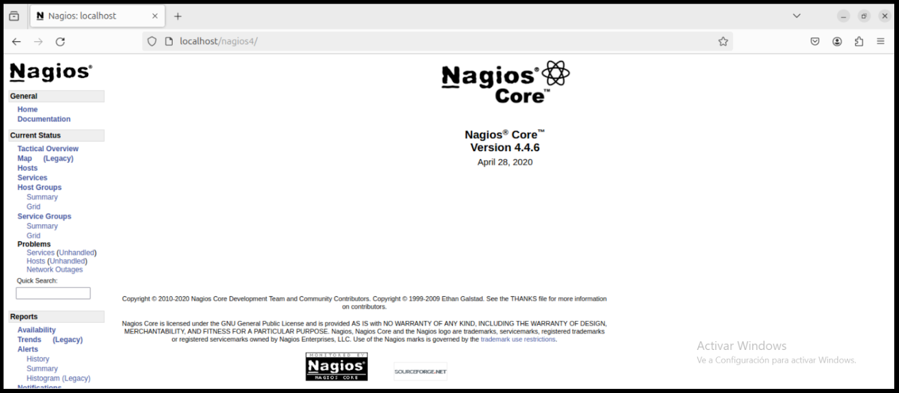
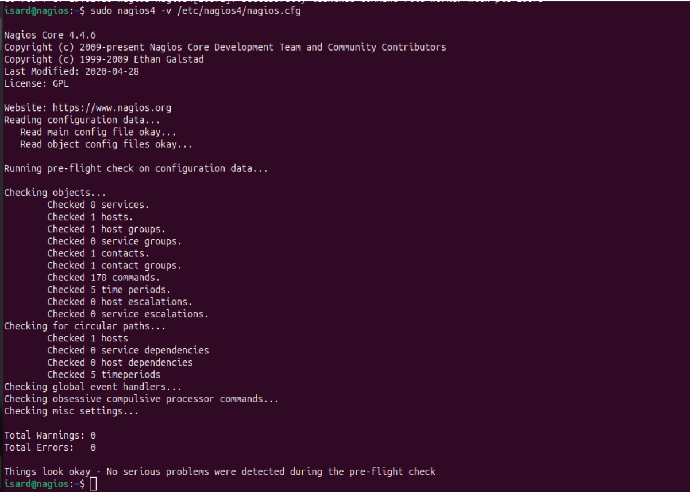
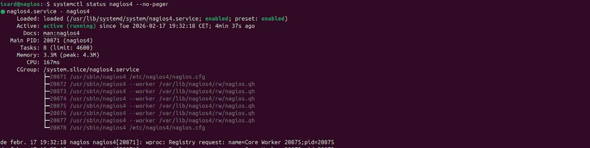
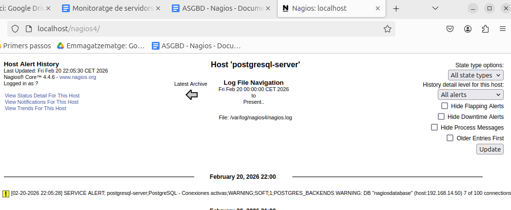
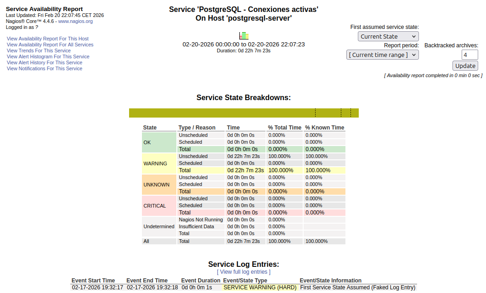
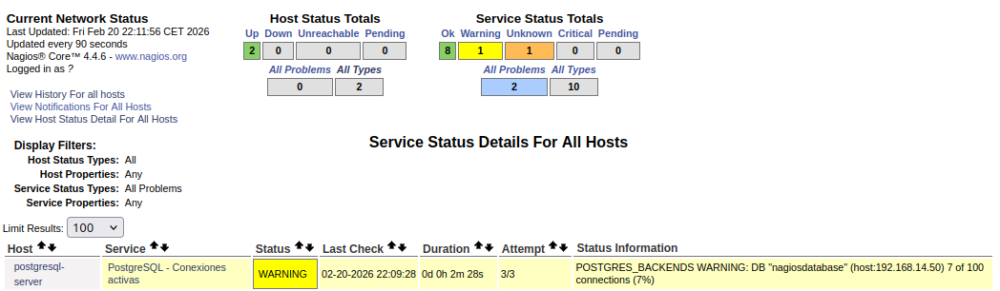
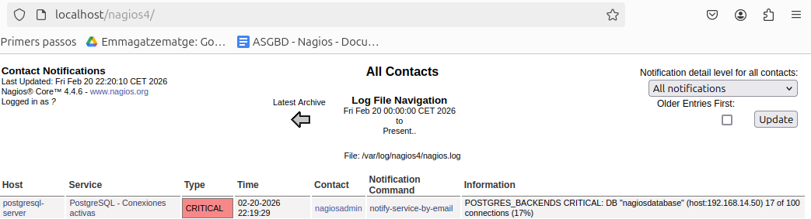

# Nagios PostgreSQL Monitoring Lab

Laboratorio de monitorización con Nagios para supervisar un servidor PostgreSQL remoto en Ubuntu.

El objetivo del proyecto fue preparar una máquina con PostgreSQL y otra con Nagios, y desde Nagios comprobar el estado del servicio PostgreSQL, la conexión a la base de datos y algunas métricas básicas mediante plugins como `check_pgsql` y `check_postgres`.

## Tecnologías utilizadas

- Ubuntu 24.04
- Nagios4
- Apache
- PHP
- PostgreSQL
- check_pgsql
- check_postgres
- Bash
- SSH

## Escenario de práctica

~~~text
Servidor PostgreSQL: 192.168.14.50
Cliente Nagios:      192.168.14.27
Base de datos:       nagiosdatabase
Usuario PostgreSQL:  nagios_monitor
~~~

Las IPs pertenecen a un entorno de laboratorio. En otro entorno habría que adaptarlas.

## Qué se trabaja

- Instalación de PostgreSQL en un servidor Ubuntu.
- Configuración de PostgreSQL para aceptar conexiones remotas.
- Creación de usuario y base de datos para monitorización.
- Instalación de Nagios4, Apache y plugins.
- Acceso al panel web de Nagios.
- Configuración de host y servicios.
- Comprobación remota con `check_pgsql`.
- Uso de `.pgpass` para evitar contraseñas en comandos.
- Uso de `check_postgres` para revisar conexiones activas.
- Validación de configuración con `nagios4 -v`.
- Pruebas de estados OK, WARNING y CRITICAL.

## Estructura del repositorio

~~~text
nagios-postgresql-monitoring-lab/
|-- README.md
|-- .gitignore
|-- .gitattributes
|-- config/
|   |-- nagios/
|   |   |-- commands-postgresql.cfg.example
|   |   |-- host-postgresql.cfg.example
|   |   |-- services-postgresql.cfg.example
|   |-- postgresql/
|   |   |-- postgresql.conf.example
|   |   |-- pg_hba.conf.example
|-- docs/
|   |-- memoria.md
|   |-- proceso.md
|-- img/
|   |-- 1.png
|   |-- 2.png
|   |-- 3.png
|   |-- 4.png
|   |-- 5.png
|   |-- instalacion.png
|   |-- nagios.png
|   |-- sudo-nagios4.png
|   |-- systemctl-status-nagios4.png
|-- scripts/
|   |-- check-nagios.sh
|   |-- check-nagios-config.sh
|   |-- check-postgresql.sh
~~~

## Instalación básica de Nagios

~~~bash
sudo apt update
sudo apt install -y nagios4 apache2 php libapache2-mod-php nagios-plugins
~~~

Activar CGI y reiniciar Apache:

~~~bash
sudo a2enmod cgi
sudo systemctl restart apache2
~~~

Crear usuario para el panel web de Nagios:

~~~bash
sudo htpasswd -c /etc/nagios4/htpasswd.users nagiosadmin
~~~

Acceso al panel:

~~~text
http://localhost/nagios4
~~~

## Comprobación de PostgreSQL desde Nagios

Ejemplo con `check_pgsql`:

~~~bash
/usr/lib/nagios/plugins/check_pgsql -H 192.168.14.50 -p 5432 -U nagios_monitor -d nagiosdatabase
~~~

Para no dejar contraseñas directamente dentro de los comandos de Nagios, se utiliza `.pgpass`.

Ejemplo:

~~~text
192.168.14.50:5432:nagiosdatabase:nagios_monitor:CHANGE_ME_DB_PASSWORD
~~~

Permisos recomendados:

~~~bash
sudo chown nagios:nagios /var/lib/nagios/.pgpass
sudo chmod 600 /var/lib/nagios/.pgpass
~~~

## Validación de configuración

Antes de reiniciar Nagios, se valida la configuración:

~~~bash
sudo nagios4 -v /etc/nagios4/nagios.cfg
~~~

Después se reinicia el servicio:

~~~bash
sudo systemctl restart nagios4
~~~

## Capturas

Panel de Nagios:

Validación de configuración:

Estado del servicio:

Pruebas de monitorización:

## Seguridad

Las contraseñas reales no se publican en el repositorio.

Se usa este placeholder:

~~~text
CHANGE_ME_DB_PASSWORD
~~~

Antes de reutilizar los ejemplos, hay que sustituirlo por una contraseña local.

## Documentación

La memoria técnica está en:

~~~text
docs/memoria.md
~~~

El proceso paso a paso está en:

~~~text
docs/proceso.md
~~~

Los ejemplos de configuración están en:

~~~text
config/
~~~
